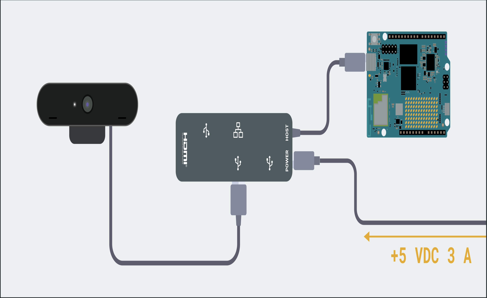
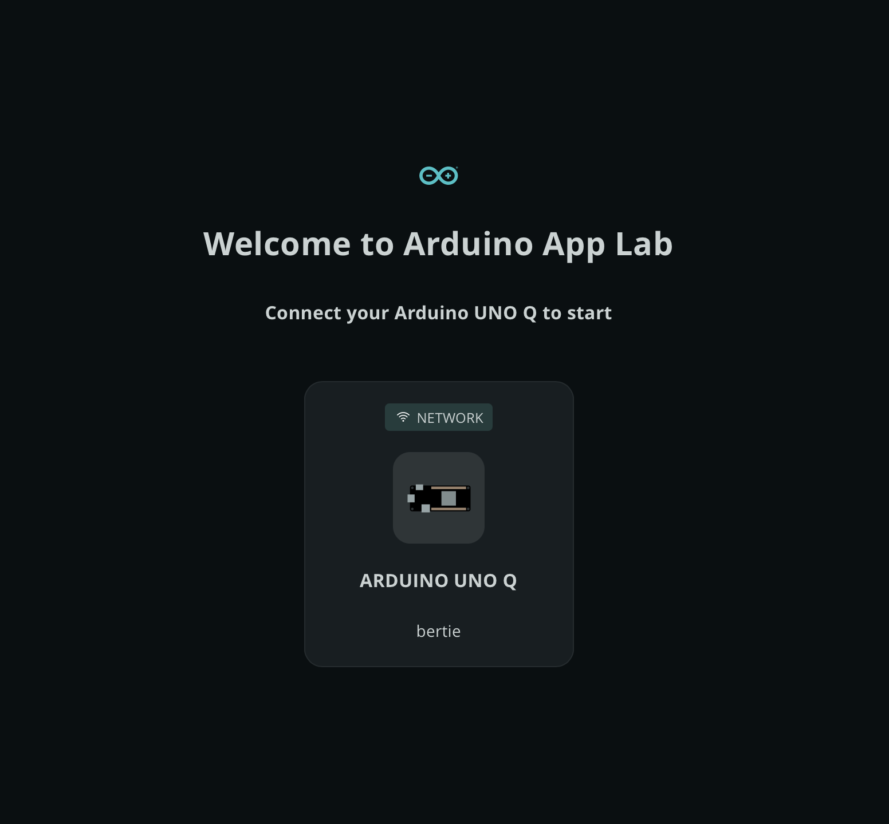
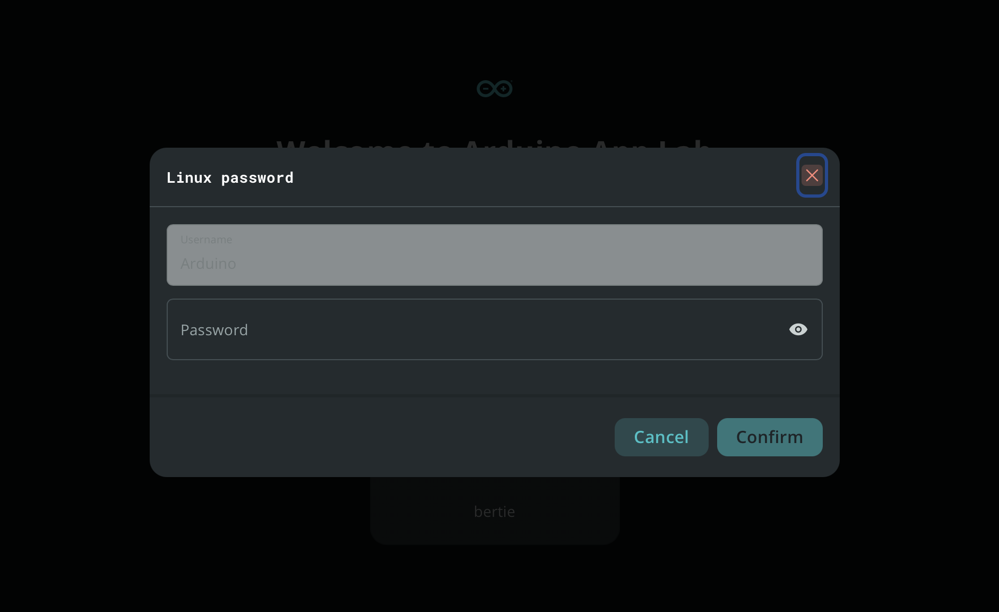
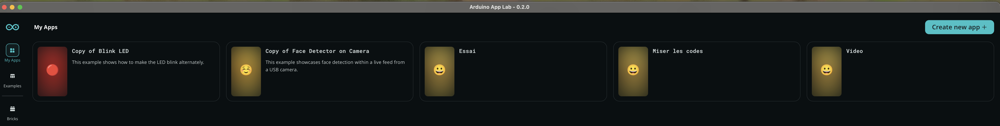
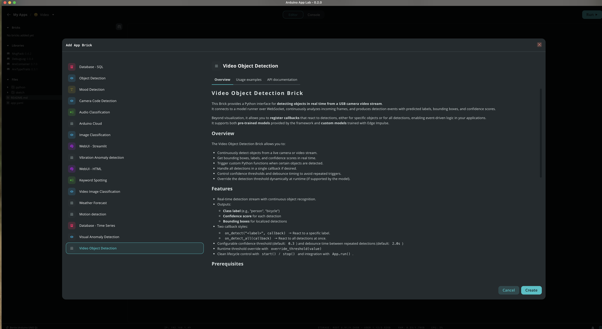
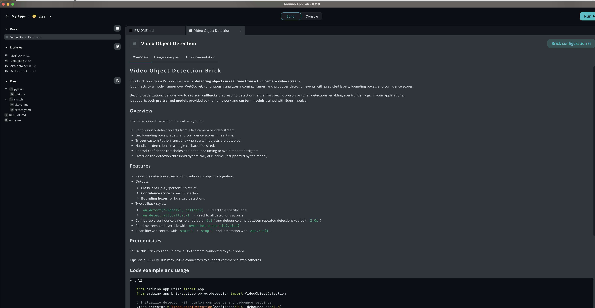
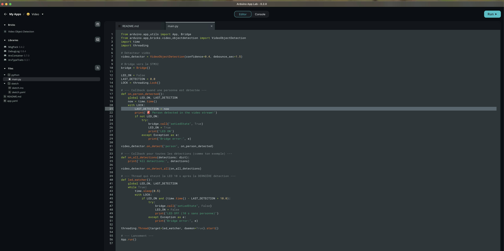
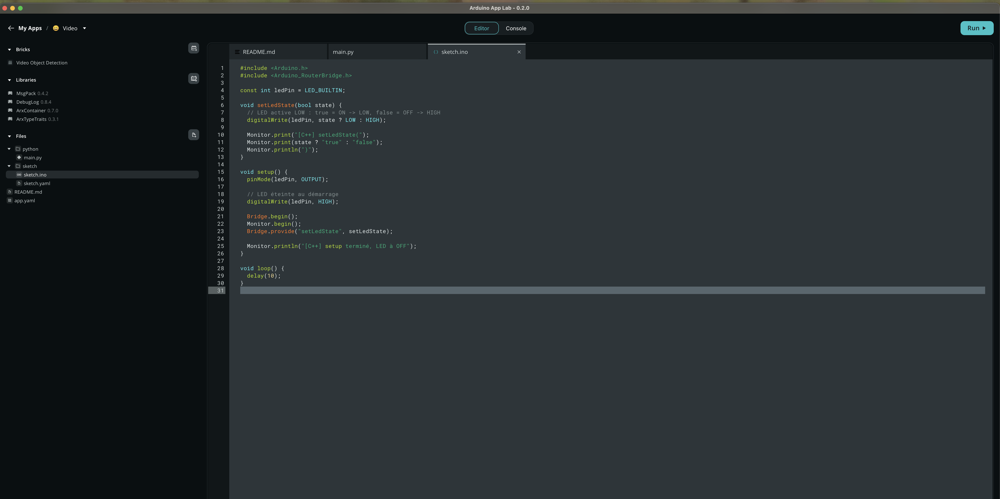

# unoq-video-detector

# 🎥 Arduino UNO Q — Détection vidéo et activation d’une LED pendant 10 secondes

Détection vidéo + activation LED avec l’Arduino UNO Q
Ce projet montre comment utiliser l’Arduino UNO Q, une webcam USB et Arduino **App Lab 0.2.0** pour :
- activer un pipeline de détection vidéo temps réel,
- repérer une personne ou un visage,
- déclencher l’allumage de la LED_BUILTIN sur le STM32 pendant 10 secondes,
- gérer la logique complète entre le cœur Linux (Python) et le cœur STM32 (C++).
  
Tout fonctionne sans code HTML, uniquement via :
✔️ Python (Linux)
✔️ C++ (STM32)
✔️ Brick Video Object Detection
✔️ Le Bridge interne entre les deux cœurs

---

## 🔧 1. Matériel utilisé
Placez le matériel comme ci-dessous :


**Liste du matériel**   
- Arduino UNO Q - https://store.arduino.cc/products/uno-q
- Webcam USB compatible Linux - https://amzn.eu/d/iWSkrtM
- HUB USB-C (avec Power Delivery + USB-A) - https://www.amazon.fr/dp/B0CF224WX9
- Alimentation 5V / USB-C PD - j'utilise celle de mon Raspberry PI 4

## 📡 2. Connexion de la UNO Q à Arduino App Lab  
### 2.1. Brancher d’abord le matériel
➡️ La UNO Q s’allume  
➡️ Le hub alimente la caméra  
➡️ L’ensemble va être détecté par App Lab via Wi-Fi  

### 2.2. Lancer Arduino App Lab
L’icône Wi-Fi apparaît automatiquement.


### 2.3. Cliquer sur la UNO Q détectée
App Lab affiche une boîte pour entrer le mot de passe Wi-Fi de la carte.


Une fois validé, vous accédez à l’interface principale.

---

## 🆕 3. Créer un nouveau projet App Lab
Cliquer sur My Apps (barre de gauche)  


Cliquer sur Create New App +  
Donner un nom, par exemple : unoQ-video-detector  
L’arborescence du projet contient automatiquement :  

- python/main.py
- sketch/sketch.ino  

## 🧱 4. Ajouter le Brick "Video Object Detection"
Cliquer sur Add (+)   


- Choisir Video Object Detection   
- Cliquer sur Create



Ce Brick fournit automatiquement :
- le container Linux EdgeImpulse  
- l’API de détection VideoObjectDetection en Python  
- la gestion du flux vidéo USB
  
Aucune configuration supplémentaire n’est nécessaire.  

---

### 🐍 5. Code Python (cœur Linux)
📄 python/main.py  

Ce code :  
- initialise la détection vidéo,
- allume la LED lorsque quelqu’un est détecté,
- lance un timer de 10 secondes d’inactivité,
- pilote le STM32 via Bridge.call().

```python
from arduino.app_utils import App, Bridge
from arduino.app_bricks.video_objectdetection import VideoObjectDetection
import time
import threading

# Détecteur vidéo
video_detector = VideoObjectDetection(confidence=0.4, debounce_sec=1.5)

# Bridge vers le STM32
bridge = Bridge()

LED_ON = False
LAST_DETECTION = 0.0
LOCK = threading.Lock()

# --- Callback quand une personne est détectée ---
def on_person_detected():
    global LED_ON, LAST_DETECTION
    now = time.time()
    with LOCK:
        LAST_DETECTION = now
        print("🚨 Person detected in the video stream!")
        if not LED_ON:
            try:
                bridge.call("setLedState", True)
                LED_ON = True
                print("LED ON")
            except Exception as e:
                print("Bridge error:", e)

video_detector.on_detect("person", on_person_detected)

# --- Callback pour toutes les détections (comme ton exemple) ---
def on_all_detections(detections: dict):
    print("All detections:", detections)

video_detector.on_detect_all(on_all_detections)

# --- Thread qui éteint la LED 10 s après la DERNIÈRE détection ---
def led_watcher():
    global LED_ON, LAST_DETECTION
    while True:
        time.sleep(0.5)
        with LOCK:
            if LED_ON and (time.time() - LAST_DETECTION > 10.0):
                try:
                    bridge.call("setLedState", False)
                    LED_ON = False
                    print("LED OFF (10 s sans personne)")
                except Exception as e:
                    print("Bridge error:", e)

threading.Thread(target=led_watcher, daemon=True).start()

# --- Lancement ---
App.run()
```
📸 Capture console Python :



### ⚙️ 6. Code STM32 (cœur temps réel C++)
📄 sketch/sketch.ino  

Ce code :  
- met la LED en sortie
- enregistre la fonction setLedState()
- reçoit les appels depuis Linux
- imprime les messages dans la console STM32

📸 Capture code C++ :


### 🎬 7. Lancement de l’application  

- Cliquer sur Run dans App Lab
- La caméra s’allume (LED blanche)
- Le flux vidéo est traité par Edge Impulse sur le Linux
- La détection déclenche la LED pendant 10 secondes


