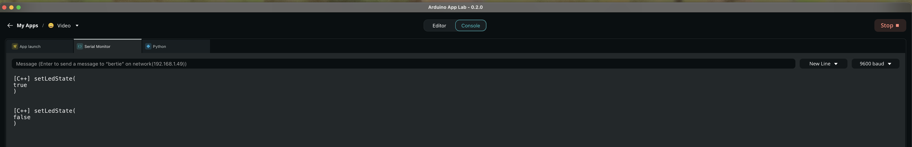

# Code STM32 – `sketch.ino`

Ce fichier contient le code qui tourne sur le cœur **STM32** de la **UNO Q**.  
Son rôle est très simple :

- recevoir des ordres du cœur Linux via le **Bridge** ;
- allumer ou éteindre la **LED_BUILTIN** selon ces ordres.

Ce sketch travaille de pair avec le code Python décrit dans `code/python/README.md`  
(qui appelle `bridge.call("setLedState", True/False)`).

---

## Code complet

```cpp
#include <Arduino.h>
#include <Arduino_RouterBridge.h>

const int ledPin = LED_BUILTIN;

// -----------------------------------------------------------------------------
// Fonction appelée depuis le cœur Linux via Bridge.call("setLedState", ...)
// -----------------------------------------------------------------------------
void setLedState(bool state) {
  // Sur la UNO Q, la LED est câblée en "active LOW" :
  // - LOW  -> LED allumée
  // - HIGH -> LED éteinte
  //
  // On décide donc :
  //   state == true  -> LED ON  (LOW)
  //   state == false -> LED OFF (HIGH)
  digitalWrite(ledPin, state ? LOW : HIGH);

  // Petit message sur le moniteur (facultatif, surtout pour le debug)
  Monitor.print("[C++] setLedState(");
  Monitor.print(state ? "true" : "false");
  Monitor.println(")");
}

void setup() {
  // Configure la broche de la LED en sortie
  pinMode(ledPin, OUTPUT);

  // On éteint la LED au démarrage (HIGH puisque active LOW)
  digitalWrite(ledPin, HIGH);

  // Initialise le Bridge (communication avec le cœur Linux)
  Bridge.begin();

  // Initialise le moniteur série côté STM32 (console dans App Lab)
  Monitor.begin();

  // Expose la fonction setLedState au cœur Linux.
  // Côté Python, on pourra appeler :
  //    bridge.call("setLedState", True)
  //    bridge.call("setLedState", False)
  Bridge.provide("setLedState", setLedState);

  Monitor.println("[C++] STM32 prêt, Bridge initialisé");
}

void loop() {
  // Pas de logique particulière côté STM32 :
  // tout est déclenché par les appels Bridge (setLedState)
  delay(10);
}

# Code STM32 – `sketch.ino`

Ce fichier contient le code qui tourne sur le cœur **STM32** de la **UNO Q**.  
Son rôle est très simple :

- recevoir des ordres du cœur Linux via le **Bridge** ;
- allumer ou éteindre la **LED_BUILTIN** selon ces ordres.

Ce sketch travaille de pair avec le code Python décrit dans `code/python/README.md`  
(qui appelle `bridge.call("setLedState", True/False)`).

---

## Code complet

```cpp
#include <Arduino.h>
#include <Arduino_RouterBridge.h>

const int ledPin = LED_BUILTIN;

// -----------------------------------------------------------------------------
// Fonction appelée depuis le cœur Linux via Bridge.call("setLedState", ...)
// -----------------------------------------------------------------------------
void setLedState(bool state) {
  // Sur la UNO Q, la LED est câblée en "active LOW" :
  // - LOW  -> LED allumée
  // - HIGH -> LED éteinte
  //
  // On décide donc :
  //   state == true  -> LED ON  (LOW)
  //   state == false -> LED OFF (HIGH)
  digitalWrite(ledPin, state ? LOW : HIGH);

  // Petit message sur le moniteur (facultatif, surtout pour le debug)
  Monitor.print("[C++] setLedState(");
  Monitor.print(state ? "true" : "false");
  Monitor.println(")");
}

void setup() {
  // Configure la broche de la LED en sortie
  pinMode(ledPin, OUTPUT);

  // On éteint la LED au démarrage (HIGH puisque active LOW)
  digitalWrite(ledPin, HIGH);

  // Initialise le Bridge (communication avec le cœur Linux)
  Bridge.begin();

  // Initialise le moniteur série côté STM32 (console dans App Lab)
  Monitor.begin();

  // Expose la fonction setLedState au cœur Linux.
  // Côté Python, on pourra appeler :
  //    bridge.call("setLedState", True)
  //    bridge.call("setLedState", False)
  Bridge.provide("setLedState", setLedState);

  Monitor.println("[C++] STM32 prêt, Bridge initialisé");
}

void loop() {
  // Pas de logique particulière côté STM32 :
  // tout est déclenché par les appels Bridge (setLedState)
  delay(10);
}
```

# Explication détaillée
## 1. Inclusions
```cpp
#include <Arduino.h>
#include <Arduino_RouterBridge.h>

```
- Arduino.h : en-tête classique Arduino (pinMode, digitalWrite, etc.).
- Arduino_RouterBridge.h : fournit :
  - Bridge : canal de communication avec le cœur Linux ;
  - Monitor : sortie texte (console) côté STM32 dans App Lab.

---

## 2. Définition de la broche LED
```cpp
const int ledPin = LED_BUILTIN;

```

- LED_BUILTIN : constante fournie par le core, qui pointe vers la LED intégrée de la UNO Q.
- On la stocke dans ledPin pour plus de lisibilité.

---

## 3. Fonction setLedState(bool state)

```cpp
void setLedState(bool state) {
  digitalWrite(ledPin, state ? LOW : HIGH);

  Monitor.print("[C++] setLedState(");
  Monitor.print(state ? "true" : "false");
  Monitor.println(")");
}


```

- Cette fonction n’est jamais appelée directement dans loop().
- Elle est appelée par le cœur Linux via :
`bridge.call("setLedState", True)` ou `bridge.call("setLedState", False)`.

**Important : LED active LOW**

- Sur la UNO Q, la LED est câblée de façon à ce que :
  - LOW → LED allumée ;
  - HIGH → LED éteinte.  
- D’où le mapping :
  - state == true → LOW → LED ON ;
  - state == false → HIGH → LED OFF.

Le bloc Monitor.print(...) : 

- n’est là que pour le debug ;
- permet, dans la console STM32 d’App Lab, de voir chaque appel :
  - [C++] setLedState(true)
  - [C++] setLedState(false).

---

4. `setup()`
```cpp
void setup() {
  pinMode(ledPin, OUTPUT);
  digitalWrite(ledPin, HIGH);

  Bridge.begin();
  Monitor.begin();

  Bridge.provide("setLedState", setLedState);

  Monitor.println("[C++] STM32 prêt, Bridge initialisé");
}

```
Détail ligne par ligne :  
#### 1. `pinMode(ledPin, OUTPUT);`
- Configure la broche de la LED en **sortie**.
#### 2. `digitalWrite(ledPin, HIGH);`
- Comme la LED est active LOW, mettre la broche à HIGH l’éteint.
- On démarre donc avec la LED éteinte.
#### 3. `Bridge.begin();`
- Initialise le canal de communication entre :
  - le cœur Linux (Python dans App Lab),
  - le cœur STM32 (ce sketch).
- Sans ça, Bridge.provide et les bridge.call(...) côté Python ne fonctionneraient pas.
#### 4. `Monitor.begin();`
- Initialise la liaison “moniteur” côté STM32.
- Permet d’afficher des logs dans Arduino App Lab (console STM32).
#### 5. `Bridge.provide("setLedState", setLedState);`
- Enregistre la fonction C++ setLedState sous le nom "setLedState" pour le Bridge.
- Côté Python, on utilise exactement le même nom de chaîne :
  - `bridge.call("setLedState", True)` → appelle cette fonction côté STM32.
- Si le nom ne correspond pas, on obtient une erreur du type :
  - `method setLedState not available`.
#### 6. `Monitor.println("[C++] STM32 prêt, Bridge initialisé");`
- Petit message de bienvenue dans la console STM32, pratique pour vérifier  
que le sketch a bien démarré et que le Bridge est initialisé.

---

5. `loop()`
```cpp
void loop() {
  delay(10);
}

```
- La boucle principale ne fait rien d’actif.
- Tout le travail est déclenché par :
  - les messages venant du cœur Linux via `Bridge`,
  - c’est-à-dire les appels à `setLedState(...)`.
    
On met un `delay(10);` très léger :  
- pour ne pas monopoliser inutilement le CPU,
- mais ici, même sans `delay`, le code fonctionnerait (la logique étant pilotée par les callbacks du Bridge).

---

# Résumé du rôle du sketch

- Expose une seule API vers le Linux : `setLedState(bool state)`.
- Interprète state avec une LED active LOW :
  - true → LED allumée ;
  - false → LED éteinte.
- Laisse la logique “intelligente” au cœur Linux (détection vidéo, temporisation 10 s, etc.).
- Sert de pont simple vers le matériel : la LED BUILTIN de la UNO Q.

---

## Vue sortie console côté STM32 :


